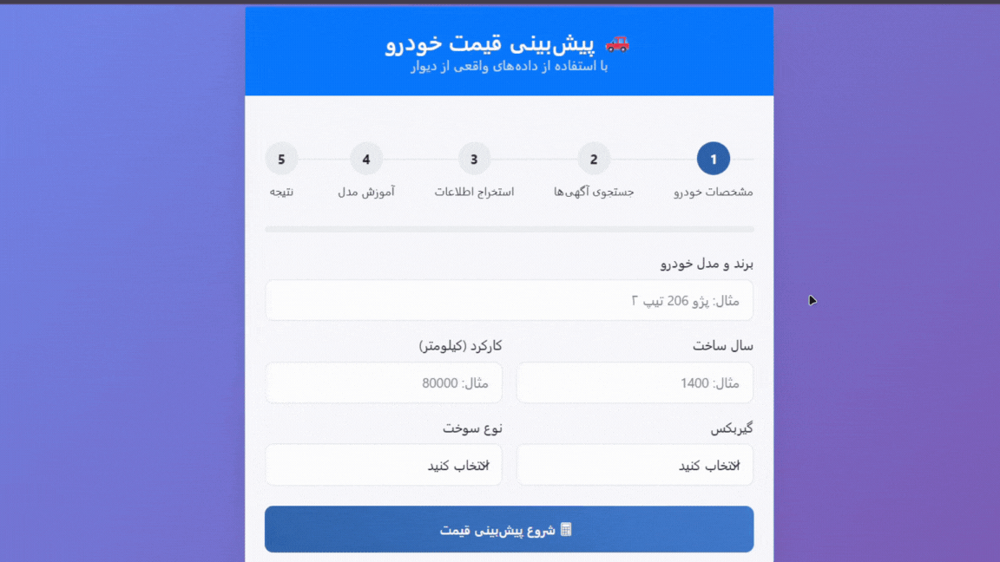
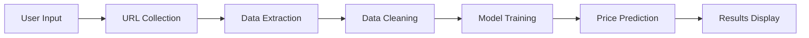

# 🚗 Car Price Predictor - Divar Scraper

<div align="center">


**A intelligent web application that predicts car prices using real data from Divar.ir with Machine Learning**

[Features](#-features) • [Demo](#-demo) • [Installation](#-installation) • [Usage](#-usage) • [Project Structure](#-project-structure) • [API](#-api) • [Contributing](#-contributing)

</div>


## 🌟 Features

- **🤖 Intelligent Price Prediction**: ML models trained on real market data
- **🌐 Real-time Data Collection**: Automated scraping from Divar.ir
- **🎯 Personalized Models**: Unique ML model for each search query
- **💻 Modern Web Interface**: Persian RTL design with progress tracking
- **📊 Performance Analytics**: Model accuracy and feature importance
- **💾 Data Persistence**: Save search history and trained models


## 🎥 Demo




## 🚀 Installation

### Prerequisites
- Python 3.8 or higher
- Chrome browser installed
- Git

### Step-by-Step Setup

1. **Clone the repository**
   ```bash
   git clone https://github.com/yourusername/car-price-predictor.git
   cd car-price-predictor
   ```

2. **Create virtual environment**
   ```bash
   python -m venv venv
   source venv/bin/activate  # On Windows: venv\Scripts\activate
   ```

3. **Install dependencies**
   ```bash
   pip install -r requirements.txt
   ```

4. **Run the application**
   ```bash
   python App/run.py
   ```

5. **Open your browser**
   ```
   http://localhost:5000
   ```


## 📖 Usage

### Web Application
1. Enter car specifications (brand, model, year, mileage, etc.)
2. The system automatically searches for similar ads on Divar
3. Real-time data extraction and ML model training
4. Get accurate price prediction with confidence intervals

### Command Line
```bash
python main_pipeline.py
```


## 🏗️ Project Structure

```
car-price-predictor-divar-scraper/
├── App/                          # Flask web application
│   ├── templates/               # HTML templates
│   ├── app.py                  # Main Flask app
│   ├── run.py                  # Application runner
│   └── wsgi.py                 # WSGI entry point
├── core/                       # Core business logic
│   ├── config.py              # Configuration settings
│   ├── save_urls.py           # URL collection module
│   ├── scrap_specific_ads.py  # Data extraction module
│   ├── train_user_model.py    # ML training module
│   └── user_input.py          # User input handling
├── Data/                       # Data storage
│   ├── UserData/              # Extracted ad data
│   ├── Models/                # Trained ML models
│   └── SearchHistory/         # User search history
├── main_pipeline.py           # Standalone CLI version
├── requirements.txt           # Python dependencies
└── README.md                  # Project documentation
```


## 🔧 API Endpoints

| Endpoint | Method | Description |
|----------|--------|-------------|
| `/` | GET | Home page with input form |
| `/predict` | POST | Submit car specifications |
| `/search_ads` | GET | Search for similar ads |
| `/scrape_data` | GET | Extract ad details |
| `/train_model` | GET | Train ML model |
| `/get_prediction` | GET | Get price prediction |
| `/status` | GET | Check progress status |


## 🤖 Machine Learning

### Model Architecture
- **Algorithm**: Random Forest Regressor
- **Features**: Year, Mileage, Gearbox, Fuel Type
- **Training**: Per-request model training
- **Evaluation**: R² Score, MAE, RMSE

### Performance
- **Accuracy**: R² Score up to 0.85+
- **Error Margin**: ±50 million Tomans
- **Training Time**: 2-5 minutes per request


## 🛠️ Technology Stack

### Backend
- **Framework**: Flask
- **ML Library**: Scikit-learn
- **Web Scraping**: Selenium, BeautifulSoup4
- **Data Processing**: Pandas, NumPy

### Frontend
- **UI Framework**: Bootstrap 5
- **Styling**: Custom CSS with RTL support
- **Icons**: Bootstrap Icons
- **JavaScript**: Vanilla JS with Fetch API

### DevOps
- **Environment Management**: venv
- **Dependency Management**: pip
- **Browser Automation**: ChromeDriver


## 📊 Data Flow




## 🚀 Deployment

### Local Development
```bash
python App/run.py
```

### Production with Gunicorn
```bash
gunicorn --bind 0.0.0.0:5000 App.wsgi:app
```

### Docker (Recommended for production)
```dockerfile
FROM python:3.9-slim
COPY . /app
WORKDIR /app
RUN pip install -r requirements.txt
EXPOSE 5000
CMD ["gunicorn", "--bind", "0.0.0.0:5000", "App.wsgi:app"]
```


## 🤝 Contributing

We love contributions! Here's how you can help:

1. **Fork** the repository
2. **Create** a feature branch (`git checkout -b feature/amazing-feature`)
3. **Commit** your changes (`git commit -m 'Add amazing feature'`)
4. **Push** to the branch (`git push origin feature/amazing-feature`)
5. **Open** a Pull Request


### Development Setup
```bash
# Install development dependencies
pip install -r requirements-dev.txt

# Run tests
python -m pytest tests/

# Code formatting
black .
```


## 🙏 Acknowledgments

- **Divar.ir** for providing the data source
- **Scikit-learn** team for excellent ML libraries
- **Selenium** for web automation capabilities
- **Bootstrap** for the beautiful UI components


## 📞 Support

If you have any questions or need help:
- 📧 Email: saeed.najafich96@gmail.com
- 💬 Issues: [GitHub Issues](https://github.com/yourusername/car-price-predictor/issues)
- 🐛 Bug Reports: Please include steps to reproduce

---


<div align="center">

**Built with ❤️ for the Iranian**

⭐ **Star this repo if you find it helpful!**

</div>


## requirements.txt
```txt
Flask==2.3.3
selenium==4.15.0
beautifulsoup4==4.12.2
pandas==2.1.3
numpy==1.25.2
scikit-learn==1.3.0
joblib==1.3.2
webdriver-manager==4.0.1
progressbar2==4.2.0
gunicorn==21.2.0
```

